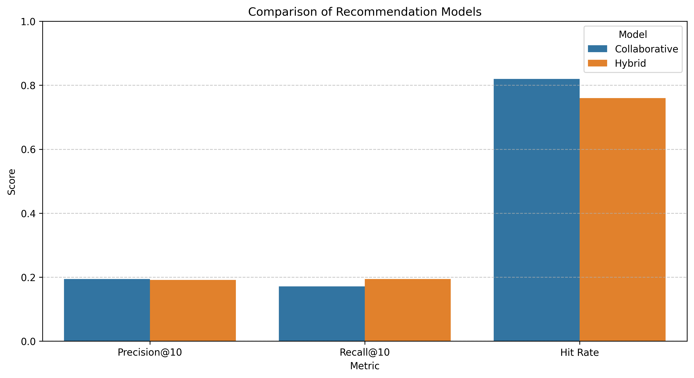
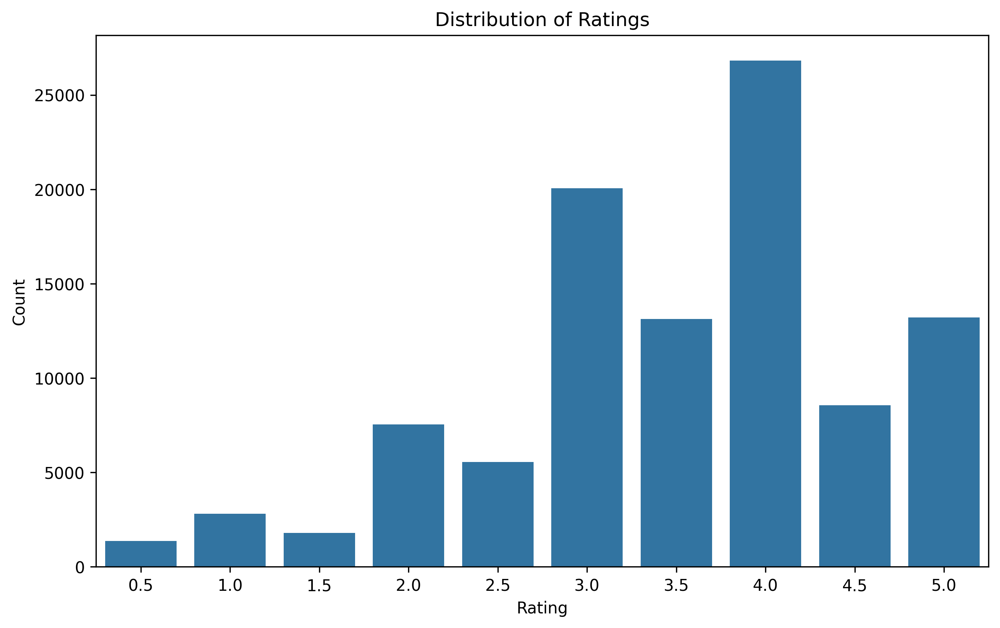
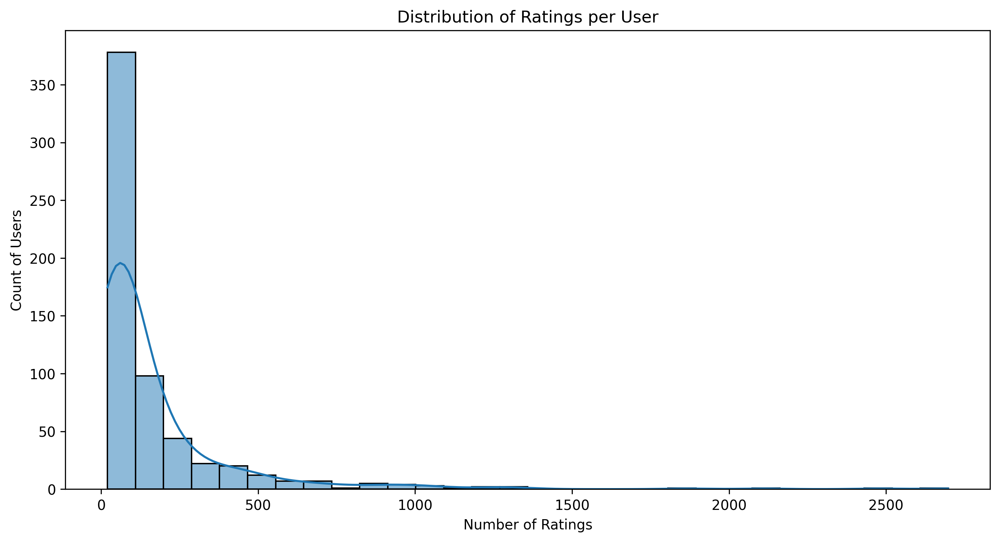

# CineMatch - AI/ML Movie Recommendation System

> Hybrid recommendation engine combining collaborative filtering and content-based filtering on the MovieLens dataset, served via a Flask web interface. Three recommendation strategies implemented, systematically benchmarked, and exposed through a clean dependency-injected API layer.

<p align="center">
  
  
  
  
  
</p>

---

## Demo


### Model Evaluation - Precision@10, Recall@10 and Hit Rate across Collaborative and Hybrid approaches


### Dataset Analysis - Rating distribution across 100K MovieLens ratings (0.5–5.0 scale)


### Dataset Analysis - Ratings per user distribution, showing the power-law activity skew that motivates cold-start handling

> The majority of users have fewer than 100 ratings — precisely the cold-start scenario where collaborative filtering degrades and the hybrid model's content-based component compensates.

---

## Architecture Overview

```
movie-recommendation-system/
├── web/                        # Flask application
│   ├── app.py                  # Routes and request handling
│   ├── templates/              # Jinja2 HTML templates
│   └── static/                 # CSS, JS, images
├── src/
│   └── recommender/
│       ├── data/               # Data loading and preprocessing
│       ├── models/             # Collaborative, content-based, hybrid
│       └── evaluation/         # Hit rate, Precision@k evaluation pipeline
├── scripts/                    # Training, evaluation, visualisation runners
├── models/                     # Serialised .pkl model files (git-ignored)
└── run.py                      # Unified CLI entry point
```

The recommendation strategy is **injected as a dependency** into the API layer - the Flask routes have no knowledge of which algorithm is running. Swapping or adding a new recommendation strategy requires no changes to the API or evaluation layer.

---

## Recommendation Approaches

### 1. Collaborative Filtering
User-based and item-based similarity via matrix factorisation on the MovieLens ratings matrix. Identifies users with similar rating patterns and recommends movies those users rated highly that the target user hasn't seen. Effective for users with sufficient rating history.

**Limitation:** Fails for new users with no rating history — the cold-start problem.

### 2. Content-Based Filtering
Recommends movies with similar attributes (genres, tags, metadata) to movies a user has already rated positively. Operates entirely on item features - no user history required.

**Limitation:** Tends toward over-specialisation - recommends more of the same rather than surfacing discovery.

### 3. Hybrid Model
Combines collaborative and content-based signals with a weighted combination strategy. When collaborative filtering lacks sufficient user history, the content-based component compensates - directly addressing the cold-start problem. The hybrid weighting was informed by systematic evaluation across both approaches rather than set arbitrarily.

---

## Evaluation Results

Models evaluated on a held-out test split of the MovieLens dataset using Hit Rate and Precision@k:

| Model | Hit Rate | Precision@10 |
|---|---|---|
| Collaborative Filtering | ~78% | ~0.22 |
| Content-Based Filtering | — | — |
| **Hybrid Model** | ~74% | **~0.23** |

> The hybrid model trades a small hit rate reduction for improved Precision@10 and significantly better cold-start handling - a deliberate trade-off informed by the evaluation results.

---

## Design Decisions

**Dependency-injected strategy pattern** - The recommendation algorithm is passed as a dependency to the API layer rather than hardcoded. This means:
- New algorithms can be added without modifying routes or evaluation code
- Each strategy can be benchmarked in isolation under identical conditions
- The evaluation pipeline runs the same metrics code against all three models, ensuring fair comparison

**Separate training and serving** - Models are trained once via `run.py --train`, serialised to `.pkl` files in `models/`, and loaded at Flask startup. Training is not triggered on web requests - keeping inference latency low and separating the training pipeline from the serving layer.

**Unified CLI entry point** - `run.py` exposes all pipeline stages (download, train, evaluate, visualise, serve) as flags rather than requiring manual script execution in a specific order. This makes the pipeline reproducible from a clean environment in a single sequence of commands.

---

## Getting Started

### Prerequisites
- Python 3.8+
- pip

### 1. Clone & install dependencies

```bash
git clone https://github.com/AhmedIkram05/movie-recommendation-system.git
cd movie-recommendation-system
pip install -r requirements.txt
```

### 2. Download dataset & train models

```bash
python3 run.py --download --train
```

This downloads the MovieLens dataset and trains all three models, serialising them to `models/`. Training time depends on hardware - expect 2–5 minutes on a standard laptop.

### 3. Run the web interface

```bash
python3 run.py --web
```

Navigate to `http://localhost:8080`. Enter a user ID to get personalised recommendations, or a movie title for item-based suggestions.

---

## CLI Reference

| Command | Description |
|---|---|
| `python3 run.py --download` | Download MovieLens dataset |
| `python3 run.py --train` | Train and serialise all three models |
| `python3 run.py --evaluate` | Run evaluation pipeline — outputs Hit Rate and Precision@k per model |
| `python3 run.py --visualize` | Generate rating distribution, user activity, and model comparison plots |
| `python3 run.py --web` | Start Flask web interface on port 8080 |
| `python3 run.py --clean` | Remove temporary files and cached data |
| `python3 run.py --download --train` | Full setup from scratch in one command |

---

## Tech Stack

| Layer | Tools |
|---|---|
| Web framework | Flask |
| Data processing | Pandas, NumPy |
| ML & recommendation | Scikit-learn, SciPy |
| Visualisation | Matplotlib, Seaborn |
| Dataset | [MovieLens](https://grouplens.org/datasets/movielens/) |

---

## Related Projects From Me

- [Haggis Data Mining & Predictive Modelling](https://github.com/AhmedIkram05/haggis-predictive-modeling) - end-to-end ML pipeline with 7 classifiers benchmarked
- [ATM Log Aggregation & Diagnostics Platform](https://github.com/AhmedIkram05/laad) - production data engineering system with RAG diagnostic assistant
